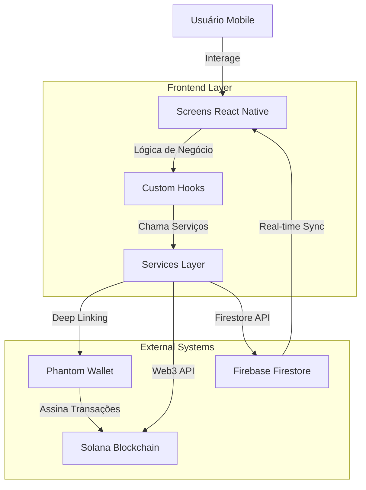

# Crypto Mobile


## 📋 Overview do Projeto

O **Crypto Mobile** é uma aplicação móvel inovadora que democratiza o acesso a transferências de criptomoedas e introduz o conceito de **Caixas Comunitários descentralizados** para gestão colaborativa de fundos digitais.

O projeto foi desenvolvido como Trabalho de Conclusão de Curso (TCC) do curso de Sistemas de Informação da UniEuro, combinando tecnologia blockchain com experiência de usuário mobile-first. Utilizando a blockchain **Solana** para transações rápidas e baratas, e **Firebase Firestore** para sincronização em tempo real, o app oferece uma ponte entre a complexidade técnica do Web3 e a simplicidade esperada por usuários comuns.

### 🎯 Principais Funcionalidades

* **Transferências Simplificadas:** Envie SOL via QR Code com a mesma facilidade do PIX
* **Caixas Comunitários:** Crie carteiras compartilhadas com governança customizável
* **Sistema de Votação:** Aprove ou rejeite saques de forma descentralizada e transparente
* **Gestão de Membros:** Hierarquia de permissões (Founder, Admin, Member, Guest)
* **Histórico Imutável:** Todos eventos registrados com transparência total

---

## 🛠 Stack Tecnológica

A arquitetura do projeto baseia-se em um aplicativo mobile nativo multiplataforma.

| Categoria | Tecnologias | Justificativa |
| :--- | :--- | :--- |
| **Core** | [React Native 0.74.5](https://reactnative.dev/), [TypeScript 5.0.4](https://www.typescriptlang.org/) | Desenvolvimento multiplataforma com type safety robusto. |
| **Build Tool** | [Expo SDK 51](https://expo.dev/) | Desenvolvimento rápido, OTA updates, APIs nativas pré-configuradas. |
| **Blockchain** | [Solana Web3.js](https://solana-labs.github.io/solana-web3.js/) | Transações ultrarrápidas (~400ms) e baratas ($0.00025). |
| **Wallet Integration** | [Phantom Wallet SDK](https://docs.phantom.com/) | Integração segura via deep linking, zero custódia de chaves. |
| **Backend** | [Firebase Firestore](https://firebase.google.com/docs/firestore) | Real-time sync, votação off-chain, histórico de eventos. |
| **UI Components** | [React Native Elements](https://reactnativeelements.com/) | Componentes mobile otimizados e customizáveis. |
| **State Management** | React Hooks (useState, useEffect, useContext) | Gerenciamento de estado simples e eficaz via hooks nativos. |
| **Criptografia** | [TweetNaCl](https://github.com/dchest/tweetnacl-js), [bs58](https://github.com/cryptocoinjs/bs58) | Criptografia end-to-end na comunicação com Phantom. |

---

## 🏗 Arquitetura e Design

O projeto segue uma **arquitetura em camadas** (Presentation, Application, Domain, Infrastructure) inspirada em Clean Architecture, promovendo separação de responsabilidades e testabilidade.

### Fluxo de Dados


### Estrutura de Pastas (Feature-Based)
```
src/
├── components/            # Componentes React reutilizáveis
│   ├── common/           # Componentes genéricos (Button, Card, LoadingSpinner)
│   └── CryptoBalanceCard.tsx
├── screens/              # Telas da aplicação
│   ├── auth/
│   │   └── PhantomConnectScreen/
│   └── main/
│       ├── HomeScreen/
│       ├── QRPayScreen/
│       ├── QRReceiveScreen/
│       ├── NFCScreen/      # Projetado, não implementado
│       └── CommunityVault/
│           ├── index.tsx
│           ├── CreateVaultScreen.tsx
│           └── VaultDetailsScreen.tsx
├── hooks/                # Custom Hooks (lógica de negócio)
│   ├── usePhantom.ts
│   ├── useBalance.ts
│   ├── useQRCode.ts
│   └── useVaultData.ts
├── services/             # Camada de integração (Infrastructure)
│   ├── phantom/
│   │   └── PhantomService.ts
│   ├── solana/
│   │   ├── SolanaService.ts
│   │   └── PriceService.ts
│   ├── firebase/
│   │   └── FirebaseService.ts
│   └── vault/
│       ├── VaultTransactionService.ts
│       └── VaultEventsService.ts
├── types/                # TypeScript types e interfaces
│   ├── phantom.ts
│   ├── wallet.ts
│   └── communityVault/
│       └── types.ts
├── constants/            # Configurações e constantes
│   ├── colors.ts
│   ├── networks.ts
│   └── validation.ts
├── utils/                # Funções utilitárias puras
│   ├── formatting.ts
│   ├── explorer.ts
│   └── crypto.ts
├── navigation/           # Configuração React Navigation
│   └── RootNavigator.tsx
└── App.tsx               # Componente raiz
```

---

## 🚀 Guia de Instalação e Execução

### Pré-requisitos

- **Node.js** (v18 ou superior)
- **npm** ou **bun** (Recomendado: Bun, devido ao `bun.lockb`)
- **Expo Go** app instalado em seu smartphone ([iOS](https://apps.apple.com/app/expo-go/id982107779) / [Android](https://play.google.com/store/apps/details?id=host.exp.exponent))
- **Phantom Wallet** instalado no mesmo dispositivo ([iOS](https://apps.apple.com/app/phantom-solana-wallet/id1598432977) / [Android](https://play.google.com/store/apps/details?id=app.phantom))
- Conta no **Firebase** (para Firestore)
- Conta no **Solana Devnet** (faucet gratuito em https://faucet.solana.com)

### Passo a Passo

**1. Clone o repositório**
```bash
git clone https://github.com/kelvin-sous/SolanaApp.git
cd SolanaApp
git checkout dev2  # Branch de desenvolvimento
```

**2. Instale as dependências**
```bash
# Usando npm
npm install

# OU usando bun (recomendado)
bun install
```

**3. Configure as Variáveis de Ambiente**

Crie um arquivo `.env` na raiz do projeto:
```bash
cp .env.example .env
```

Edite o `.env` com suas credenciais (veja seção abaixo).

**4. Configure Firebase**

- Crie um projeto no [Firebase Console](https://console.firebase.google.com)
- Ative o Firestore Database
- Baixe o `google-services.json` (Android) e `GoogleService-Info.plist` (iOS)
- Coloque os arquivos nas pastas apropriadas conforme documentação Expo

**5. Execute o Servidor de Desenvolvimento**
```bash
npm start
# ou
bun start
```

Escaneie o QR Code com o **Expo Go** no seu smartphone.

**6. (Opcional) Execute em Emulador**
```bash
# iOS (requer macOS + Xcode)
npm run ios

# Android (requer Android Studio)
npm run android
```

---

## 🔑 Variáveis de Ambiente

Configure as seguintes variáveis no seu arquivo `.env`:

| Variável | Tipo | Descrição | Exemplo |
|----------|------|-----------|---------|
| `FIREBASE_API_KEY` | string | Chave de API do Firebase | `AIzaSyC...` |
| `FIREBASE_AUTH_DOMAIN` | string | Domínio de autenticação | `crypto-mobile.firebaseapp.com` |
| `FIREBASE_PROJECT_ID` | string | ID do projeto Firebase | `crypto-mobile-12345` |
| `FIREBASE_STORAGE_BUCKET` | string | Bucket de storage | `crypto-mobile.appspot.com` |
| `FIREBASE_MESSAGING_SENDER_ID` | string | ID do sender de mensagens | `123456789` |
| `FIREBASE_APP_ID` | string | ID do app Firebase | `1:123456789:web:abc123` |
| `SOLANA_NETWORK` | string | Rede Solana (devnet/mainnet-beta) | `devnet` |

**⚠️ Atenção:** Nunca comite o arquivo `.env` com credenciais reais. Adicione-o ao `.gitignore`.

---

## 🧪 Testing

### Estratégia de Testes

Atualmente, o projeto utiliza **testes manuais exploratórios**. A implementação de testes automatizados está planejada para versões futuras.

**Testes Realizados:**

- ✅ Conexão com Phantom Wallet: 15 tentativas, 100% sucesso
- ✅ Transferências QR Code: 25 transações, 96% sucesso
- ✅ Criação de Vaults: 10 vaults, 100% sucesso
- ✅ Sistema de Votação: 8 cenários, 100% sucesso

### Roadmap de Testes

**Curto Prazo:**
- Implementar testes unitários com Jest
- Adicionar testes de componentes com Testing Library
- Configurar CI/CD com GitHub Actions

**Médio Prazo:**
- Testes E2E com Detox
- Cobertura de testes >70%

### Como Executar Testes (Quando Implementados)
```bash
# Testes unitários
npm test

# Testes com cobertura
npm test -- --coverage

# Testes E2E
npm run test:e2e
```

---

## ☁️ Deployment

### Build para Produção

**Android (APK):**
```bash
# Build local
eas build --platform android --profile production

# Ou via EAS (Expo Application Services)
eas build --platform android
```

**iOS (IPA):**
```bash
# Requer conta Apple Developer
eas build --platform ios --profile production
```

### Distribuição

**App Stores:**
- Google Play Store: Seguir processo padrão de submissão
- Apple App Store: Revisão necessária

**TestFlight / Google Play Beta:**
- Distribuição para testadores beta
- Coletar feedback antes do launch oficial

### CI/CD (Futuro)

Planejado para GitHub Actions:
```yaml
# .github/workflows/deploy.yml
name: Deploy
on:
  push:
    branches: [main]
jobs:
  build:
    runs-on: ubuntu-latest
    steps:
      - uses: actions/checkout@v2
      - name: Install dependencies
        run: npm install
      - name: Build
        run: eas build --platform all
```

---

## 📖 Funcionalidades Principais

### 1. Transferências via QR Code

**Como usar:**

1. Abra o app e conecte sua Phantom Wallet
2. Toque em "Pagar" na home screen
3. Escaneie o QR Code do destinatário
4. Confirme o valor e taxa
5. Aprove na Phantom
6. Transação confirmada em ~1.2s

### 2. Caixas Comunitários

**Como criar:**

1. Na home screen, toque em "Criar Novo Caixa"
2. Configure:
   - Nome e ícone
   - Taxa de entrada (entry fee)
   - Máximo de membros
   - Regras de votação (%, unanimidade, etc.)
3. Convide membros compartilhando o ID do caixa
4. Membros depositam e solicitam saques
5. Votação automática quando configurado

**Casos de Uso:**

- 🌍 **Viagens em grupo:** Junte dinheiro para férias
- 💰 **Investimentos coletivos:** Fundo de cripto em grupo
- 👨‍👩‍👧 **Mesada familiar:** Pais controlam, filhos sacam
- 🏢 **Despesas corporativas:** Equipes gerenciam orçamentos

---

## 🤝 Guidelines de Contribuição

Contribuições são bem-vindas! Siga estas diretrizes:

### 1. Padrão de Commits

Utilize **Conventional Commits**:
```bash
feat: adiciona sistema de votação
fix: corrige bug de saldo negativo
docs: atualiza README com screenshots
refactor: reorganiza estrutura de services
test: adiciona testes para VaultService
```

### 2. Workflow

1. Fork o projeto
2. Crie uma branch: `git checkout -b feature/minha-feature`
3. Commit suas mudanças: `git commit -m 'feat: minha feature'`
4. Push para a branch: `git push origin feature/minha-feature`
5. Abra um Pull Request

### 3. Code Style

- Use **TypeScript** para type safety
- Siga **ESLint** rules configuradas
- Componentes devem ser **funcionais** (React Hooks)
- Extraia lógica complexa para **custom hooks**
- Mantenha **services stateless**

### 4. Documentação

- Adicione **JSDoc** para funções complexas
- Atualize README se adicionar funcionalidades
- Inclua screenshots de novas telas

---

## 📚 Documentação Adicional

- **TCC Completo:** [docs/TCC_FINAL.docx](https://github.com/kelvin-sous/SolanaApp/blob/dev2/docs/TCC_FINAL.docx)
- **Solana Docs:** https://docs.solana.com
- **Phantom Docs:** https://docs.phantom.com
- **Firebase Docs:** https://firebase.google.com/docs

---

## 🐛 Issues Conhecidos

- [ ] **NFC não implementado:** Projetado mas não funcional (limitação Expo managed workflow)
- [ ] **Testes externos pendentes:** Validação com usuários reais programada
- [ ] **Saldo Firestore vs. Blockchain:** Ocasionalmente pode desincronizar em transações muito rápidas

---

## 🗺️ Roadmap

### Q1 2026
- ✅ MVP funcional
- ✅ Testes internos completos
- 🔲 Beta público (50-100 usuários)
- 🔲 Testes externos e NPS

### Q2 2026
- 🔲 Implementação de NFC
- 🔲 Migração vaults para smart contracts (PDAs)
- 🔲 Launch App Store + Google Play

### Q3-Q4 2026
- 🔲 Suporte multi-chain (Ethereum, Polygon)
- 🔲 Parcerias com outras carteiras
- 🔲 50K+ usuários ativos

---

## 👥 Equipe

**Desenvolvedores:**
- Kelvin Lima de Sousa - [GitHub](https://github.com/kelvin-sous)
- Elson José de Gois

**Orientador:**
- Dr. Éfrem Filho - UniEuro

---

## 📄 Licença

Este projeto está sob a licença **MIT**. Veja o arquivo [LICENSE](LICENSE) para mais detalhes.

---

## 🙏 Agradecimentos

- **Phantom Wallet** pela documentação de qualidade
- **Solana Foundation** pela infraestrutura blockchain
- **Comunidade cripto brasileira** pelo feedback valioso
- **UniEuro** pela formação acadêmica

---

## 📧 Contato

Para dúvidas, sugestões ou parcerias:

- **Email:** [prokelvin65@gmail.com]
- **GitHub Issues:** [Abrir issue](https://github.com/kelvin-sous/SolanaApp/issues)
- **LinkedIn:** [[Seu LinkedIn](https://www.linkedin.com/in/kelvin-lima-806062210/)]

---
